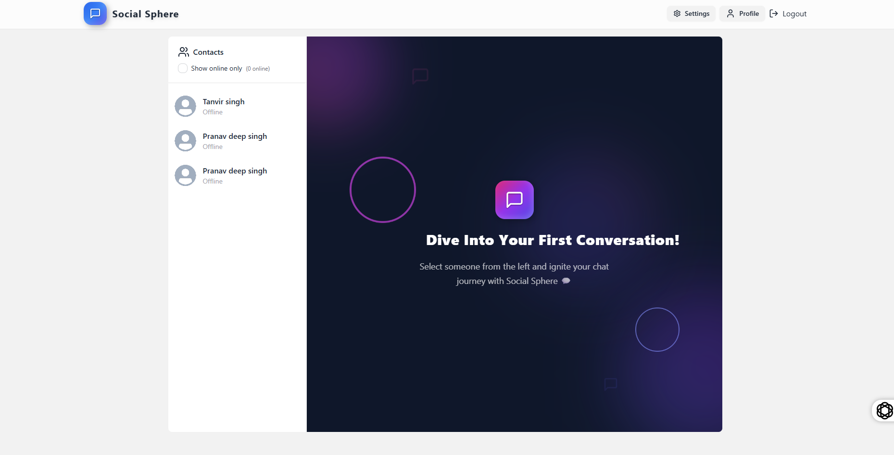

# 🌐 SocialSphere — Real-Time Chat App

**SocialSphere** is a real-time chat application built using the **MERN stack**. It enables secure and instant one-on-one messaging with **Socket.io**, supports **authentication**, **online/offline status**, **mobile responsiveness**, and **dark/light mode** — all hosted on modern cloud platforms.

---
### Dashboard 

## 🔗 Live Demo

- 🖥️ Frontend (Netlify): [https://socialsphere0.netlify.app](https://socialsphere0.netlify.app)

---

## 🚀 Features

- 🔐 JWT-based Authentication (Signup/Login)
- 💬 Real-time One-to-One Messaging using **Socket.io**
- 🟢 Live Online/Offline Status Indicators
- 🔍 Search Users by Name or Email
- 🌓 Dark & Light Mode Toggle
- 📱 Mobile-Friendly and Responsive UI
- ☁️ Deployed using **Netlify** (Frontend) & **Render** (Backend)

---

## 🛠 Tech Stack

### 💻 Frontend
- React.js (with Vite)
- Tailwind CSS
- Zustand (for global state)
- Axios
- Lucide Icons
- React Router DOM

### 🧠 Backend
- Node.js + Express.js
- MongoDB + Mongoose
- Socket.io (WebSocket support)
- JWT + bcryptjs + cookie-parser
- CORS + dotenv

---

## 📁 Folder Structure

<pre>
Social Sphere
├── backend/ # Express Backend
│ ├── routes/ # API endpoints
│ ├── controllers/ # Business logic
│ ├── models/ # MongoDB schemas
│ ├── middleware/ # Auth and error handlers
│ └── server.js # Entry point
│
├── frontend/ # React Frontend
│ ├── components/ # Reusable UI components
│ ├── pages/ # Route-based pages
│ ├── store/ # Zustand store
│ ├── App.jsx # App structure
│ └── main.jsx # Root file
│
├── .env # Environment variables
├── netlify.toml # Netlify configuration
└── README.md
</pre>

## 📈 Future Enhancements
📷 Profile Picture Uploads

🧵 Group Chat Support

📬 Message Read Receipts

🔔 Real-Time Notifications

💬 Emoji Support + Rich Media

## ⚙️ Installation

### 1. Clone the repository

git clone https://github.com/withyoutanvir/SocialSphere.git

### 2.backend-Setup
cd SocialSphere
cd Backend
npm install
npm run dev
---
### 3.Front-end Setup
cd frontend
npm install
npm run dev

### 4.Add this to your .env
MONGO_URI=your_mongo_connection
JWT_SECRET=your_jwt_secret
PORT=5000

## 📄 License
MIT License

Copyright (c) 2025 Tanvir SIngh

Permission is hereby granted, free of charge, to any person obtaining a copy
of this software and associated documentation files (the "Software"), to deal
in the Software without restriction, including without limitation the rights 
to use, copy, modify, merge, publish, distribute, sublicense, and/or sell 
copies of the Software, and to permit persons to whom the Software is 
furnished to do so, subject to the following conditions:

The above copyright notice and this permission notice shall be included 
in all copies or substantial portions of the Software.

THE SOFTWARE IS PROVIDED "AS IS", WITHOUT WARRANTY OF ANY KIND, EXPRESS OR 
IMPLIED, INCLUDING BUT NOT LIMITED TO THE WARRANTIES OF MERCHANTABILITY, 
FITNESS FOR A PARTICULAR PURPOSE AND NONINFRINGEMENT. IN NO EVENT SHALL THE 
AUTHORS OR COPYRIGHT HOLDERS BE LIABLE FOR ANY CLAIM, DAMAGES OR OTHER 
LIABILITY, WHETHER IN AN ACTION OF CONTRACT, TORT OR OTHERWISE, ARISING 
FROM, OUT OF OR IN CONNECTION WITH THE SOFTWARE OR THE USE OR OTHER 
DEALINGS IN THE SOFTWARE.

